<div align="center">

# claudectx

**Launch Claude Code with different profiles**

<br/>



<br/>
<br/>

[](LICENSE)
[](https://crates.io/crates/claudectx)
[](https://github.com/FGRibreau/claudectx/actions)
[](https://github.com/FGRibreau/claudectx/releases)
[](https://github.com/FGRibreau/claudectx/stargazers)

</div>

---

## What is this?

**claudectx** manages multiple Claude Code profiles (Claude Max, Claude Team, personal) by saving and launching with different configurations. Each profile is a complete `claude.json` config with its own account, MCP servers, and settings. Inspired by [kubectx](https://github.com/FGRibreau/kubectx-rs).

## Features

- **Direct launch** - Run `claudectx profile` to launch Claude with that profile
- **Save profiles** - Store complete Claude configurations locally
- **Quick switch** - Interactive selection with arrow keys
- **Pass-through args** - Forward arguments to claude via `--`
- **Auto-slugify** - Profile names are normalized (`FG@Work` → `fg-work`)
- **Zero config** - Works out of the box

---

## Sponsors

<table>
  <tr>
    <td align="center" width="200">
        <a href="https://getnatalia.com/">
        <br/>
        <b>Natalia</b>
        </a><br/>
        <sub>24/7 AI voice and whatsapp agent for customer services</sub>
    </td>
    <td align="center" width="200">
      <a href="https://nobullshitconseil.com/">
        <br/>
        <b>NoBullshitConseil</b>
      </a><br/>
      <sub>360° tech consulting</sub>
    </td>
    <td align="center" width="200">
      <a href="https://www.hook0.com/">
        <br/>
        <b>Hook0</b>
      </a><br/>
      <sub>Open-Source Webhooks-as-a-Service</sub>
    </td>
    <td align="center" width="200">
      <a href="https://france-nuage.fr/">
        <br/>
        <b>France-Nuage</b>
      </a><br/>
      <sub>Sovereign cloud hosting in France</sub>
    </td>
  </tr>
</table>

> **Interested in sponsoring?** [Get in touch](mailto:sponsoring@fgribreau.com)

---

## Quick Start

```sh
# 1. Install
brew install FGRibreau/tap/claudectx

# 2. Save your current account
claudectx save work

# 3. Launch Claude with profile
claudectx work

# Or select interactively
claudectx
```

---

## Installation

### macOS

```sh
# Homebrew (recommended)
brew install FGRibreau/tap/claudectx

# or with Cargo
cargo install claudectx
```

### Linux

```sh
# Debian/Ubuntu (.deb)
curl -LO https://github.com/FGRibreau/claudectx/releases/latest/download/claudectx_0.1.0_amd64.deb
sudo dpkg -i claudectx_0.1.0_amd64.deb

# Cargo (all distros)
cargo install claudectx

# or download binary
curl -LO https://github.com/FGRibreau/claudectx/releases/latest/download/claudectx_linux_x86_64.tar.gz
tar -xzf claudectx_linux_x86_64.tar.gz
sudo mv claudectx /usr/local/bin/
```

### Windows

```powershell
# Chocolatey
choco install claudectx

# Scoop
scoop bucket add extras
scoop install claudectx

# or with Cargo
cargo install claudectx
```

### All platforms

| Platform | Method | Command |
|----------|--------|---------|
| macOS | Homebrew | `brew install FGRibreau/tap/claudectx` |
| macOS | Cargo | `cargo install claudectx` |
| Linux | Debian/Ubuntu | `sudo dpkg -i claudectx_*_amd64.deb` |
| Linux | Cargo | `cargo install claudectx` |
| Windows | Chocolatey | `choco install claudectx` |
| Windows | Scoop | `scoop install claudectx` |
| Windows | Cargo | `cargo install claudectx` |
| All | Binary | [Download from Releases](https://github.com/FGRibreau/claudectx/releases) |

<details>
<summary>Available binaries</summary>

| Platform | Architecture | Download |
|----------|--------------|----------|
| Linux | x86_64 | `claudectx_linux_x86_64.tar.gz` |
| Linux | x86_64 (static) | `claudectx_linux_x86_64_musl.tar.gz` |
| Linux | ARM64 | `claudectx_linux_aarch64.tar.gz` |
| Linux | ARM64 (static) | `claudectx_linux_aarch64_musl.tar.gz` |
| Linux | ARMv7 | `claudectx_linux_armv7.tar.gz` |
| Linux | x86_64 (.deb) | `claudectx_*_amd64.deb` |
| Linux | ARM64 (.deb) | `claudectx_*_arm64.deb` |
| macOS | Intel | `claudectx_darwin_x86_64.tar.gz` |
| macOS | Apple Silicon | `claudectx_darwin_aarch64.tar.gz` |
| Windows | x86_64 | `claudectx_windows_x86_64.zip` |

</details>

<details>
<summary>Manual installation from source</summary>

```sh
git clone https://github.com/FGRibreau/claudectx.git
cd claudectx
cargo build --release
sudo cp target/release/claudectx /usr/local/bin/
```

</details>

---

## Usage

| Command | Description |
|---------|-------------|
| `claudectx` | Interactive profile selection, then launch Claude |
| `claudectx <profile>` | Launch Claude with specified profile |
| `claudectx <profile> -- <args>` | Launch with profile and extra arguments |
| `claudectx list` | List all saved profiles |
| `claudectx save <name>` | Save current config as profile |
| `claudectx delete <name>` | Delete a profile |

### Examples

```sh
# Launch Claude with "work" profile
claudectx work

# Launch with extra arguments
claudectx work -- --dangerously-skip-permissions

# Save current ~/.claude.json as "personal" profile
claudectx save personal

# Interactive selection then launch
claudectx

# List all profiles
claudectx list
# Output:
# work - FG @ Company *
# personal - FG @ Personal
```

---

## Configuration

### Storage

Profiles are stored as individual JSON files in `~/.claudectx/`:

```
~/.claudectx/
├── work.claude.json
├── personal.claude.json
└── side-project.claude.json
```

Each profile is a complete copy of `~/.claude.json`, including:
- OAuth account (email, organization)
- MCP servers configuration
- Claude Code settings
- API keys

### Profile Names

Profile names are automatically slugified:
- `My Work Profile` → `my-work-profile`
- `FG@Company` → `fg-company`
- `Test Name` → `test-name`

---

## How it works

1. **Save**: `claudectx save work` copies `~/.claude.json` to `~/.claudectx/work.claude.json`
2. **Launch**: `claudectx work` runs `claude --settings ~/.claudectx/work.claude.json`
3. **Select**: `claudectx` shows an interactive picker, then launches the selected profile

---

## License

[MIT](LICENSE)

---

<div align="center">

**Like claudectx?** Check out [kubectx-rs](https://github.com/FGRibreau/kubectx-rs) for Kubernetes context switching

</div>
